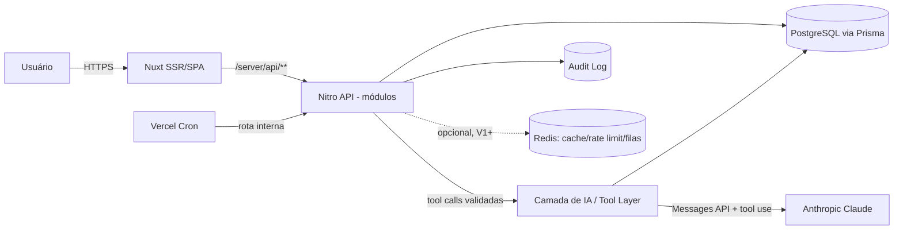
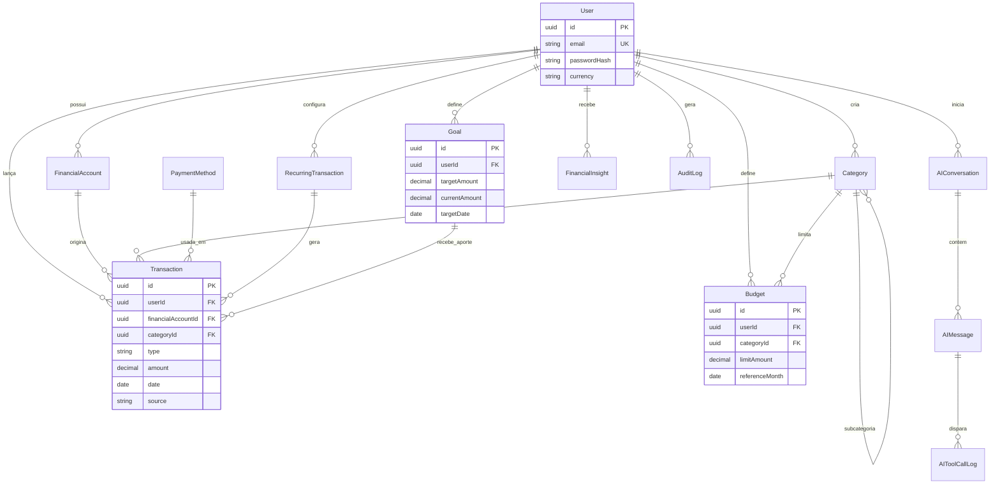
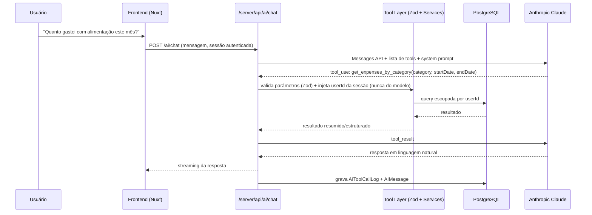
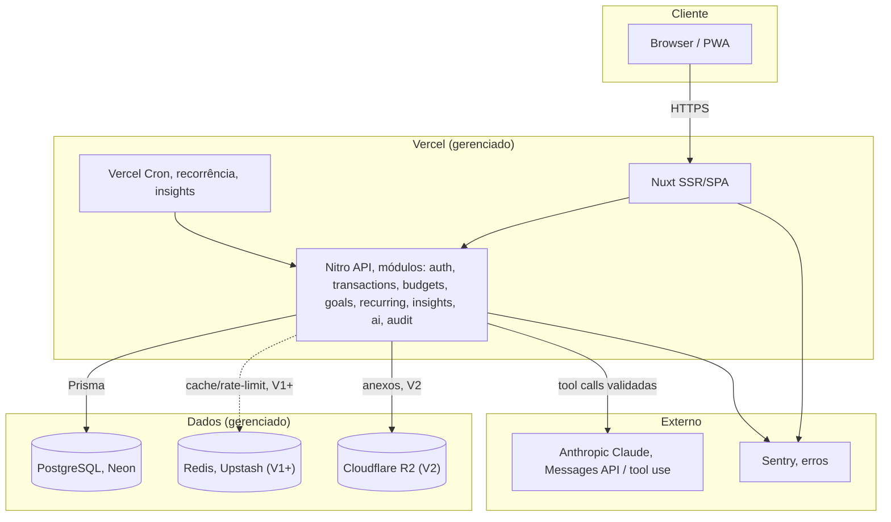

# Bruno Finanças: Arquitetura Técnica

> Documento de arquitetura de referência. Público-alvo: quem for construir o produto (hoje, um dev solo; amanhã, um time).
> Premissas assumidas e confirmadas com o autor do produto: **equipe solo no início**, **orçamento bootstrap/custo mínimo**, **preferência por infraestrutura totalmente gerenciada** (sem assumir AWS), **Anthropic Claude como provedor de IA padrão** (arquitetura desenhada para trocar de provedor sem reescrever o produto). Stack de frontend/dados definida pelo autor: **Nuxt + Vue 3 + TypeScript, shadcn-vue, PostgreSQL, Prisma, Zod, Redis opcional**.

> **Decisão posterior (30/09/2026): IA removida do produto.** O assistente de IA (seção D) foi implementado, testado com provedores gratuitos (Google Gemini free tier) e **removido**: indisponibilidade (503), limites e respostas inconsistentes do free tier tornavam a função pouco confiável para uso diário, e o produto tem restrição de **custo zero**. O caso de uso principal, "gastei 25 no almoço", passou a ser atendido pelo **lançamento rápido** (`shared/quick-add.ts`): um parser determinístico de valor/tipo/categoria/data, sem serviço externo, testado e sempre com o mesmo resultado. O canal de WhatsApp, construído sobre o assistente, saiu junto. Tabelas `ai_*` e campos de WhatsApp foram removidos (migração `20260930120000_remove_ai`); a origem `ai_nl` virou `quick_add`, preservando os lançamentos existentes. As seções D e fluxos de IA abaixo ficam como registro histórico do desenho, caso o tema volte com um provedor pago.

---

## Sumário

- [0. Contexto e princípios](#0-contexto-e-princípios)
- [A. Arquitetura geral](#a-arquitetura-geral)
- [B. Stack tecnológica](#b-stack-tecnológica)
- [C. Modelagem de dados](#c-modelagem-de-dados)
- [D. Arquitetura do módulo de IA](#d-arquitetura-do-módulo-de-ia)
- [E. Fluxos importantes](#e-fluxos-importantes)
- [F. API](#f-api)
- [G. Arquitetura de frontend](#g-arquitetura-de-frontend)
- [H. Segurança](#h-segurança)
- [I. Escalabilidade](#i-escalabilidade)
- [J. Observabilidade](#j-observabilidade)
- [K. Testes](#k-testes)
- [L. Infraestrutura](#l-infraestrutura)
- [5. Roadmap](#5-roadmap)
- [6. Decisão arquitetural final](#6-decisão-arquitetural-final)
- [7. Incertezas e próximos passos](#7-incertezas-e-próximos-passos)

---

## 0. Contexto e princípios

O Bruno Finanças não é "mais um app de anotar gasto", é um assistente financeiro pessoal, o que muda a arquitetura em dois pontos centrais:

1. **Dados financeiros são dados sensíveis.** Toda decisão de stack passa primeiro pelo filtro de segurança/isolamento, depois por custo, depois por conveniência.
2. **A IA precisa ser um consumidor "de segunda classe" dos dados**, nunca um atalho que ignora as regras de negócio e autorização que o resto do sistema respeita. Isso define praticamente toda a seção D.

Princípios que guiam as escolhas abaixo:

- **Simplicidade que não te prende.** Monólito modular, não microsserviços, mas com fronteiras internas desenhadas para que, se um dia for necessário extrair um módulo, isso seja um refactor, não uma reescrita.
- **Segurança por padrão, não por adição.** Autorização, validação e auditoria entram no esqueleto do projeto desde o primeiro endpoint, não como "hardening" depois.
- **Custo proporcional ao estágio.** Nada de provisionar para 100 mil usuários enquanto o produto tem 100. Cada decisão de infra tem um gatilho explícito de quando evolui (seção I).
- **DX de solo dev.** Um único dev precisa conseguir rodar, entender e operar o sistema inteiro. Isso pesa contra qualquer escolha que exija operar múltiplos serviços, clusters ou runtimes diferentes sem necessidade real.

---

## A. Arquitetura geral

### Tipo de arquitetura: monólito modular

**Decisão: monólito modular (modular monolith), não microsserviços.**

| Critério | Monólito modular | Microsserviços |
|---|---|---|
| Complexidade operacional | Um único deployável, um único banco, um pipeline de CI/CD | Múltiplos serviços, deploys independentes, service discovery, contratos entre serviços |
| Adequação a 1 dev | Alta, dá pra segurar sozinho | Baixa, overhead de operação supera o time disponível |
| Transações consistentes (ex.: criar despesa + atualizar orçamento + gerar insight) | Transação de banco local, simples e forte (ACID) | Exige saga/outbox, consistência eventual, mais bugs sutis |
| Velocidade de desenvolvimento inicial | Alta | Baixa (boilerplate de comunicação entre serviços) |
| Custo de infra | Baixo | Alto (N bancos/serviços rodando) |
| Quando faz sentido | Produto novo, equipe pequena, domínio ainda mudando rápido | Domínio estável, times múltiplos, necessidade real de escalar partes de forma independente |

Microsserviços resolvem um problema que o Bruno Finanças não tem hoje: **times múltiplos pisando um no outro**. Com 1 dev, esse problema não existe, e a "taxa" de operar N serviços (observabilidade, deploy, rede, autenticação entre serviços) é paga todo dia sem benefício correspondente. Isso é overengineering clássico para o estágio atual.

### Separação de responsabilidades: módulos internos

O backend (rodando dentro do próprio Nuxt, ver seção B) é organizado por **domínio**, não por camada técnica. Cada módulo expõe um `service` (regra de negócio), usa Prisma para acesso a dado, valida entrada/saída com Zod, e só se comunica com os outros módulos via chamadas de função explícitas (nunca acessando o repository de outro módulo diretamente):

```
server/
  modules/
    auth/            → sessão, login, registro, recuperação de senha
    users/           → perfil, preferências
    transactions/    → receitas e despesas
    categories/      → categorias e subcategorias
    payment-methods/
    budgets/         → orçamentos e progresso
    goals/           → metas financeiras
    recurring/       → transações recorrentes (geração/projeção)
    insights/        → geração de insights financeiros
    ai/              → chat com IA, tools, lançamento por linguagem natural
    audit/           → trilha de auditoria (usada pelos outros módulos, não o contrário)
```

Regra fixa: **`ai` só fala com os outros módulos através dos `services` deles**, nunca com o Prisma Client diretamente. Isso é o que garante, estruturalmente, que a IA não tenha acesso irrestrito ao banco (detalhado na seção D).

### Comunicação entre componentes

- **Frontend ↔ Backend:** HTTP/JSON via as rotas Nitro do próprio Nuxt (`/server/api/**`), mesma origem, sem CORS a gerenciar no MVP.
- **Backend ↔ Banco:** Prisma Client, conexão via pool serverless-friendly (Neon serverless driver / Prisma Accelerate, ver seção B).
- **Backend ↔ IA:** chamada HTTP para a API do provedor (Anthropic), sempre partindo do servidor, nunca do browser (chave de API nunca chega ao cliente).
- **Jobs agendados (recorrência, insights mensais):** Vercel Cron chamando uma rota interna autenticada por secret (`/server/api/internal/cron/*`).
- Dentro do monólito, comunicação é **in-process, síncrona, chamada de função**: sem fila nem broker no MVP. Fila (Redis/BullMQ ou Upstash QStash) só entra quando houver trabalho assíncrono real (ver seção I).

### Fluxo de dados (visão geral)



### Estratégia para evolução futura

O monólito é desenhado com "costuras" (seams) explícitas para extração futura, sem que isso exija reescrever regra de negócio:

1. **Módulo `ai` é o primeiro candidato a virar serviço separado**: perfil de custo, latência e escala diferente do resto (chamadas longas, streaming, picos de uso). Como já fala só através de `services` bem definidos, extrair vira "colocar uma API na frente desse módulo", não reescrever lógica.
2. **Jobs pesados** (geração de insight em lote, reprocessamento) têm seus `services` desenhados como funções puras que recebem `userId`: dá para movê-los para um worker dedicado sem tocar no restante.
3. **Banco único hoje, mas schema já particionado logicamente** por domínio (prefixos de tabela implícitos via nome do model no Prisma): facilita um eventual split de banco, se um domínio crescer desproporcionalmente (ex.: `transactions`).

---

## B. Stack tecnológica

> Tabela de decisão por área: **escolha**, por que, alternativas comparadas, quando a alternativa seria melhor. Itens marcados **[definido pelo usuário]** foram fixados como requisito; os demais são recomendação do arquiteto para o cenário (solo dev, bootstrap, managed).

### Frontend: Nuxt 3 + Vue 3 + TypeScript **[definido]**

Nuxt já era a preferência declarada. Validando com um comparativo honesto:

| | **Nuxt 3 (Vue)** | Next.js (React) | SvelteKit |
|---|---|---|---|
| Curva de aprendizado | Mais suave (Vue é mais explícito/menos "mágico" que React) | Média/alta (JSX, hooks, regras próprias) | Suave |
| Full-stack no mesmo framework (SSR + API routes) | Sim, via Nitro, muito maduro | Sim, via Route Handlers | Sim, via endpoints |
| Ecossistema/mercado de trabalho | Menor que React | Maior, mais libs, mais exemplos, mais IA treinada em cima disso | Menor |
| Ecosystem de IA/streaming de chat | Bom (`@ai-sdk/vue` cobre o essencial) | Melhor (Vercel AI SDK nasceu "React-first") | Ok |
| Adequação a 1 dev que já gosta de Vue | Alta | Alta (se preferisse React) | Alta, mas comunidade menor pesa a favor de suporte |

**Veredito:** Nuxt é uma escolha legítima, não um erro corrigido pela "força do hábito". A única razão objetiva para trocar por Next.js seria: (a) planejar contratar um time e o pool de devs React ser maior, ou (b) depender pesadamente de features do Vercel AI SDK que só chegam primeiro em React. Nenhuma das duas se aplica ao momento atual → **mantém Nuxt**.

- **Deploy:** Vercel (integração nativa com Nuxt/Nitro, preview deployments por PR, cron jobs, edge network/CDN incluído).
- **UI/Design system:** **shadcn-vue [definido]** sobre Tailwind CSS, componentes copiados para o repo (não é uma dependência de terceiros rodando em produção), o que dá controle total sobre acessibilidade e estilização de valores monetários/estados (positivo/negativo, alerta de orçamento etc.), sem lock-in de biblioteca de UI.
- **Estado:** Pinia para estado de cliente puro (UI, wizard de onboarding); `useAsyncData`/`useFetch` (nativos do Nuxt) para estado de servidor, detalhado na seção G.

### Backend/API: Nitro (server routes do Nuxt), monólito modular

| | **Nitro (dentro do Nuxt)** | NestJS (API separada) | FastAPI (Python, API separada) |
|---|---|---|---|
| Deploys a operar | 1 (frontend+backend juntos) | 2 (frontend + backend) | 2 |
| Fit com stack já escolhida (TS, Prisma, Zod) | Total, mesmo `tsconfig`, mesmos tipos | Total (também TS) | Nenhum, troca de linguagem, duplica ecossistema de validação/ORM |
| Estrutura/DI/testabilidade "de fábrica" | Menor, precisa impor convenção própria (módulos + services, como definido acima) | Alta, guards, interceptors, pipes prontos, muito usado em fintech | Alta, mas em outro ecossistema |
| Jobs longos/streaming em serverless | Funciona bem (Vercel functions + streaming, cron) | Melhor se o processo for de longa duração (worker dedicado) | idem |
| Overhead operacional p/ solo dev | Mínimo | Médio (2 apps, 2 pipelines, CORS entre elas) | Médio-alto |

**Veredito:** para o estágio atual (solo dev, bootstrap, tudo gerenciado), **Nitro dentro do próprio Nuxt** vence por eliminar uma app inteira de operação, sem abrir mão de estrutura, a estrutura vem de **impormos manualmente** o padrão de módulos da seção A (services + Zod + Prisma), que é exatamente o que o NestJS daria "de graça" com mais peso. NestJS voltaria à mesa no momento em que: (1) o time crescer e for útil separar deploy de front e back, ou (2) o módulo de IA precisar de um processo de longa duração fora do modelo serverless da Vercel (ver seção I, gatilhos de extração).

- **REST vs GraphQL:** **REST + OpenAPI**. Cada endpoint mapeia 1:1 com uma ação de negócio, o que facilita rate limiting/autorização por rota e, ponto importante aqui, **cada "tool" que a IA chama é literalmente a mesma função de service por trás de um endpoint REST**, então manter os dois em REST simplifica a superfície de auditoria. GraphQL seria melhor se o frontend precisasse compor queries muito flexíveis vindas de múltiplos clientes (web, mobile, parceiros) com necessidades de campos diferentes, não é o caso agora.

### Banco de dados: PostgreSQL **[definido]**

| | **PostgreSQL** | MySQL | Firestore/NoSQL doc |
|---|---|---|---|
| Consistência forte (saldo, orçamento, transações) | Sim (ACID, transações reais) | Sim | Fraca/eventual em muitos casos |
| Queries analíticas (dashboard, agregações por categoria/mês) | Excelente (window functions, CTEs) | Boa | Ruim sem ferramenta extra |
| Constraints/relacional (FKs entre transação, categoria, orçamento) | Nativo | Nativo | Modelado manualmente, propenso a inconsistência |
| Extensões relevantes | `pgcrypto`, `pg_partman` (particionamento futuro), RLS nativo | Menos extensível | N/A |

Postgres é a escolha certa para dado financeiro estruturado e relacional, não há ambiguidade real aqui, o próprio usuário já converge para isso.

**Hospedagem:** recomendado **Neon** (Postgres serverless gerenciado: free tier real, *database branching* por PR/ambiente, muito valioso para 1 dev testar migrations com segurança, escala a zero em dev). Alternativas: **Railway** (mais simples, bom para quem quer "1 clique", menos recursos de branching) e **RDS/Cloud SQL** (só fazem sentido se/quando migrar para AWS/GCP "de verdade", overkill agora). Como o modelo é Postgres puro via Prisma, trocar de um provedor para outro é só trocar a connection string.

### ORM: Prisma **[definido]**

- **Por quê:** melhor DX do ecossistema TS para modelar, migrar e consultar Postgres; `schema.prisma` funciona como documentação viva do modelo de dados; Prisma Studio ajuda muito um dev solo a inspecionar dado sem escrever SQL toda hora.
- **Ressalva técnica importante:** Prisma abre uma conexão TCP por instância, em ambiente serverless (funções da Vercel escalando horizontalmente) isso pode estourar o limite de conexões do Postgres rapidamente. Mitigação: usar o **driver adapter serverless do Prisma com Neon** (`@prisma/adapter-neon`, conexão via HTTP/WebSocket) ou **Prisma Accelerate** (pool gerenciado pela própria Prisma). Isso entra desde o MVP, não é uma otimização adiável, é o tipo de detalhe que "funciona em dev e cai em produção" se ignorado.
- **Alternativa considerada:** Drizzle (mais leve, mais "SQL-like", melhor cold-start): melhor opção se em algum momento o overhead do Prisma Client em cold start virar um problema real medido (ver seção I); não é motivo para trocar hoje, dado que o usuário já definiu Prisma e o ganho de DX compensa no estágio atual.

### Validação: Zod **[definido]**

Usado em três fronteiras de confiança, sempre:
1. Body/query de toda rota `/server/api/**`.
2. Parâmetros de cada **tool** de IA (seção D): a validação mais crítica do sistema.
3. Formulários do frontend (o mesmo schema Zod é reaproveitado no client via `vee-validate` + `@vee-validate/zod`, evitando duplicar regra de validação entre front e back).

### Cache / Filas: Redis opcional **[definido]**

- **MVP:** sem Redis. Rate limiting simples via contadores no Postgres (tabela `request_log` com índice por `userId`+janela) ou middleware in-memory por instância (aceitável no volume inicial); recorrência processada direto por Vercel Cron chamando a rota, com idempotência garantida por constraint única (`recurringTransactionId + referenceMonth`).
- **V1, quando necessário:** **Upstash Redis** (serverless, cobrança por request, sem servidor para administrar) para: cache de respostas caras (ex.: sumários de dashboard), rate limiting distribuído (importante quando há múltiplas instâncias serverless simultâneas) e fila leve (BullMQ compatível, ou Upstash QStash para "fire-and-forget" com retry, ex.: gerar insights de todos os usuários no fechamento do mês).
- **Por que não entra desde já:** é a aplicação direta do princípio "custo proporcional ao estágio", no volume de um MVP solo, Redis é complexidade sem benefício mensurável. O gatilho concreto para adicionar está na seção I.

### Autenticação: recomendação: Better Auth (não estava na lista do usuário: sinalizado como decisão em aberto)

| | **Better Auth** | Auth.js/NextAuth (via `sidebase/nuxt-auth`) | Rolar na mão (Prisma + Argon2 + cookies) |
|---|---|---|---|
| Adapter oficial Prisma | Sim | Sim | N/A |
| Hashing/sessão/reset de senha prontos e auditados | Sim | Sim (parcial, mais focado em OAuth) | Você escreve e você é responsável pelos bugs |
| MFA / verificação de e-mail | Suporte nativo, fácil de ligar depois | Requer mais integração manual | Você escreve |
| Maturidade no ecossistema Vue/Nuxt | Boa e crescente | Historicamente mais forte no lado Next | N/A |

Dado financeiro sensível + dev solo = **a pior hora para reinventar hashing de senha e fluxo de recuperação**. Recomendo Better Auth com adapter Prisma, sessão validada sempre no servidor (nunca confiar em claim vindo do client para autorizar mutação). Isso é uma recomendação, não um requisito do usuário, fica marcado para confirmação (seção 7).

### Cloud / Hospedagem: gerenciado, sem AWS por padrão

| | **Vercel (frontend+backend)** | Railway/Render (containers gerenciados) | AWS/GCP/Azure "puro" |
|---|---|---|---|
| Esforço operacional (solo dev) | Mínimo | Baixo | Alto |
| Custo inicial | Free tier cobre o MVP confortavelmente | Baixo, cresce com uso | Geralmente maior e menos previsível no início |
| Fit com Nuxt/Nitro | Nativo (Nitro tem preset Vercel) | Bom (via Docker) | Bom, mas exige orquestração própria |
| Quando migrar | Quando precisar de processos de longa duração fora do modelo serverless | Não se aplica | Quando exigências de compliance/contrato exigirem uma cloud específica, ou escala justificar equipe de infra dedicada |

**Recomendação:** Vercel para tudo no MVP/V1. AWS/GCP/Azure não trazem benefício real no estágio atual e adicionam superfície de configuração (IAM, VPC, security groups) que é mais risco de erro de segurança do que proteção, indo contra o princípio de "seguro por padrão" (menos coisa pra configurar errado).

### Storage: Cloudflare R2

S3-compatível, sem custo de egress (diferença relevante para exportar relatórios/anexos), free tier generoso. Só entra em uso real a partir de V2 (anexo de comprovante).

### Observabilidade: ver seção J
### CI/CD: GitHub Actions + deploy automático Vercel
### Testes: ver seção K

### IA: Anthropic Claude atrás de uma interface própria

- **Escolha do modelo/provedor:** Anthropic Claude (Messages API, tool use nativo), conforme definido. A integração **não** chama o SDK da Anthropic espalhado pelo código, passa por uma interface `ChatProvider` (método `sendMessage(messages, tools) → response`) implementada uma vez para Claude. Trocar de provedor (ou usar mais de um) no futuro é escrever um novo adapter, não reescrever o módulo `ai`.
- **Alternativa comparada:** OpenAI (ecossistema mais maduro em volume de exemplos, function calling também sólido): decisão do usuário já converge para Anthropic; ambos atendem tecnicamente, então isso é preferência, não obrigação técnica.

---

## C. Modelagem de dados

Entidades da lista original do usuário foram mantidas quase todas, com um ajuste de nome (`Account` → `FinancialAccount`, para não colidir semanticamente com "conta do usuário"/login) e duas adições que a especificação implícita exige: `AIToolCallLog` (auditoria específica das chamadas de ferramenta da IA, central para a seção D) e `AuditLog` (auditoria genérica de mutações sensíveis).

### User
- **Responsabilidade:** identidade e credenciais do usuário (via Better Auth) + preferências.
- **Campos principais:** `id (uuid)`, `email (unique)`, `name`, `passwordHash` (gerenciado pela lib de auth), `emailVerifiedAt`, `locale`, `currency` (default `BRL`), `createdAt`, `updatedAt`, `deletedAt`.
- **Relacionamentos:** 1:N com `FinancialAccount`, `Transaction`, `Category`, `Budget`, `Goal`, `RecurringTransaction`, `AIConversation`, `AuditLog`.
- **Índices:** único em `email`.
- **Constraints:** e-mail obrigatório único; `deletedAt` para soft delete (LGPD: usuário pode pedir exclusão, soft delete com expurgo definitivo agendado após período de retenção legal).

### FinancialAccount (ex-"Account")
- **Responsabilidade:** representa uma "carteira"/conta financeira do usuário (conta corrente, carteira, cartão): permite, desde já, separar saldo por origem sem forçar isso na v1 da UI.
- **Campos:** `id`, `userId`, `name`, `type` (enum: `checking`, `wallet`, `credit_card`, `savings`, `other`), `initialBalance`, `currency`, `archivedAt`, `createdAt`, `updatedAt`.
- **Relacionamentos:** N:1 com `User`; 1:N com `Transaction`.
- **Índices:** `userId`.
- **Constraints:** `userId` obrigatório em toda query (nunca listar contas sem filtro de dono, base do controle de IDOR, seção H).

### Category / Subcategoria
- **Responsabilidade:** taxonomia de classificação de transações; suporta subcategoria via self-reference.
- **Campos:** `id`, `userId` (nulo = categoria padrão do sistema, compartilhada), `parentId` (nullable, self-FK), `name`, `icon`, `color`, `type` (`income`/`expense`), `isSystem` (bool), `createdAt`.
- **Relacionamentos:** self-relation (`parent`/`children`); 1:N com `Transaction`, `Budget`.
- **Índices:** `userId`, `parentId`.
- **Constraints:** categoria do sistema (`isSystem=true`) não pode ser deletada pelo usuário, só desativada; `parentId` não pode apontar para si mesma nem criar ciclo (validado na service layer, não só no banco).

### PaymentMethod
- **Responsabilidade:** forma de pagamento associada a uma transação (dinheiro, pix, cartão X).
- **Campos:** `id`, `userId`, `name`, `type` (enum: `cash`, `debit`, `credit`, `pix`, `transfer`, `other`), `financialAccountId` (nullable, vincula método a uma conta específica, ex. um cartão específico), `archivedAt`.
- **Relacionamentos:** N:1 `User`, N:1 `FinancialAccount` (opcional); 1:N `Transaction`.
- **Índices:** `userId`.

### Transaction
- **Responsabilidade:** o núcleo do sistema, um lançamento de receita ou despesa.
- **Campos:** `id`, `userId`, `financialAccountId`, `categoryId`, `paymentMethodId (nullable)`, `type` (`income`/`expense`), `amount` (`Decimal`, **nunca float**), `currency`, `description`, `date`, `isFixed` (bool, despesa fixa vs variável), `recurringTransactionId` (nullable, FK, se originada de recorrência), `source` (`manual`/`ai_nl`/`recurring`: rastreia origem, importante para auditoria do lançamento por linguagem natural), `createdAt`, `updatedAt`, `deletedAt`.
- **Relacionamentos:** N:1 com `User`, `FinancialAccount`, `Category`, `PaymentMethod`, `RecurringTransaction` (opcional).
- **Índices:** composto `(userId, date)` (consulta mais comum: extrato/período), `(userId, categoryId, date)` (dashboard por categoria), `(userId, type, date)`.
- **Constraints:** `amount > 0` (sinal vem de `type`, não do valor, evita bug clássico de valor negativo se propagando em soma); `userId` sempre obrigatório e sempre no `WHERE` de qualquer query (nível de aplicação) + **Row Level Security no Postgres como defesa em profundidade** (mesmo sem depender de um BaaS específico, RLS nativo do Postgres pode ser ativado com a sessão de banco carregando o `userId` corrente).
- **Auditoria:** nunca DELETE físico, soft delete (`deletedAt`) + registro em `AuditLog` para toda alteração de valor/categoria/data (edição de lançamento financeiro é evento sensível).

### Budget
- **Responsabilidade:** limite de gasto por categoria em um período.
- **Campos:** `id`, `userId`, `categoryId`, `limitAmount`, `period` (`monthly` no MVP), `referenceMonth` (primeiro dia do mês, ex. `2026-08-01`), `alertThresholdPct` (default 80%), `createdAt`, `updatedAt`.
- **Relacionamentos:** N:1 `User`, N:1 `Category`.
- **Índices:** único composto `(userId, categoryId, referenceMonth)`: não pode haver dois orçamentos para a mesma categoria/mês.
- **Cálculo de progresso:** **não é campo persistido**: computado sob demanda (soma de `Transaction` do período) para nunca dessincronizar do dado real; cacheável (Redis, V1) se virar hot path.

### Goal
- **Responsabilidade:** objetivo financeiro de médio/longo prazo ("guardar R$10.000 até dezembro").
- **Campos:** `id`, `userId`, `name`, `targetAmount`, `currentAmount` (atualizado por aporte manual ou vínculo com transações marcadas como "aporte"), `targetDate`, `status` (`active`/`completed`/`abandoned`), `createdAt`.
- **Relacionamentos:** N:1 `User`; opcionalmente 1:N com `Transaction` marcadas como aporte da meta (`goalId` nullable em `Transaction`: decisão de modelo: ligar transação a meta é opcional, cobre o caso "cada depósito na poupança é um aporte rastreável" sem forçar isso a quem só quer acompanhar manualmente).
- **Índices:** `userId`.
- **Cálculo "quanto economizar por mês":** derivado (`(targetAmount - currentAmount) / mesesRestantes`), nunca armazenado, sempre recalculado para refletir o progresso real.

### RecurringTransaction
- **Responsabilidade:** template de transação que se repete (assinatura, salário, aluguel).
- **Campos:** `id`, `userId`, `financialAccountId`, `categoryId`, `paymentMethodId`, `type`, `amount`, `description`, `frequency` (`weekly`/`monthly`/`yearly`), `dayOfMonth` (ou regra equivalente), `startDate`, `endDate (nullable)`, `active` (bool), `lastGeneratedFor` (referência de período, evita duplicar geração).
- **Relacionamentos:** N:1 `User`; 1:N `Transaction` (as instâncias geradas).
- **Índices:** `userId`, `(active, frequency)` (usado pelo job de geração).
- **Constraint de idempotência:** única `(recurringTransactionId, referenceMonth)` nas `Transaction` geradas, o cron pode rodar de novo sem duplicar lançamento.

### FinancialInsight
- **Responsabilidade:** resultado persistido de uma análise (ex.: "gastos com alimentação subiram 25% este mês"), gerado por regra determinística e/ou por IA.
- **Campos:** `id`, `userId`, `type` (enum: `category_increase`, `top_expense`, `goal_projection`, `budget_alert`, ...), `payload` (JSON com os dados estruturados que sustentam o texto, nunca só o texto solto, para permitir re-renderizar/traduzir/auditar), `title`, `description`, `severity` (`info`/`warning`), `referencePeriod`, `generatedBy` (`rule_engine`/`ai`), `readAt (nullable)`, `createdAt`.
- **Relacionamentos:** N:1 `User`.
- **Índices:** `(userId, createdAt)`.
- **Nota de design:** a maioria dos insights do MVP é **regra determinística** (comparação de somas entre períodos, barato, previsível, sem custo de IA). IA entra para os insights que pedem linguagem mais rica ou correlação não trivial (seção D explica o corte).

### AIConversation
- **Responsabilidade:** uma thread de chat entre usuário e assistente.
- **Campos:** `id`, `userId`, `title` (gerado a partir da primeira mensagem), `createdAt`, `updatedAt`, `archivedAt`.
- **Relacionamentos:** N:1 `User`; 1:N `AIMessage`.
- **Índices:** `(userId, updatedAt)`.

### AIMessage
- **Responsabilidade:** cada mensagem de uma conversa (usuário, assistente ou resultado de tool).
- **Campos:** `id`, `conversationId`, `role` (`user`/`assistant`/`tool`), `content` (texto), `toolCalls` (JSON, se houver), `tokensInput`, `tokensOutput`, `createdAt`.
- **Relacionamentos:** N:1 `AIConversation`.
- **Índices:** `(conversationId, createdAt)`.
- **Retenção/minimização:** conteúdo de mensagem é dado sensível, política de retenção configurável (ex.: expurgo após X meses) documentada na seção H/LGPD.

### AIToolCallLog *(entidade adicionada: não estava na lista original, mas é exigida pela seção D)*
- **Responsabilidade:** auditoria granular de cada chamada de ferramenta feita pela IA, o registro que prova, tecnicamente, que a IA só acessou o que tinha permissão de acessar.
- **Campos:** `id`, `userId`, `conversationId`, `messageId`, `toolName`, `parametersRaw` (JSON, os argumentos que o modelo pediu), `parametersValidated` (JSON, após passar pelo Zod), `resultSummary` (JSON, o que foi de fato retornado, nunca o dump bruto do banco, ver seção D), `durationMs`, `status` (`success`/`validation_error`/`denied`), `createdAt`.
- **Índices:** `(userId, createdAt)`, `toolName`.
- **Uso:** base para observabilidade de custo/uso de IA (seção J) e para investigar qualquer suspeita de comportamento indevido do modelo.

### AuditLog *(entidade adicionada: auditoria genérica)*
- **Responsabilidade:** trilha de auditoria para mutações sensíveis fora do escopo de IA (login, alteração de senha, edição/exclusão de transação, mudança de limite de orçamento).
- **Campos:** `id`, `userId`, `actorType` (`user`/`system`/`ai`), `action`, `entityType`, `entityId`, `before` (JSON, nullable), `after` (JSON, nullable), `ip`, `userAgent`, `createdAt`.
- **Índices:** `(userId, createdAt)`, `(entityType, entityId)`.
- **Retenção:** mais longa que dado operacional comum, é a evidência em caso de disputa ("por que meu saldo mudou") ou incidente de segurança.

### Diagrama ER conceitual



---

## D. Arquitetura do módulo de IA

Esta é a seção mais sensível do sistema porque combina dois requisitos em tensão: a IA precisa "enxergar" os dados do usuário para ser útil, mas **não pode** ter acesso irrestrito ao banco.

### Princípio central: tool calling, nunca acesso direto

O LLM **nunca** recebe uma connection string, nunca gera SQL, nunca vê o schema do banco. O único jeito de a IA obter dado é chamando uma **tool** pré-definida, tipada e com autorização embutida.



### Como as tools são definidas

Cada tool é uma função TypeScript com: (1) schema Zod de entrada, (2) schema Zod de saída, (3) implementação que **sempre** recebe `userId` injetado pelo backend (nunca como parâmetro que o modelo preenche), (4) um `service` do domínio por trás, a mesma função que o endpoint REST equivalente usa.

```ts
// server/modules/ai/tools/get-expenses-by-category.ts
export const getExpensesByCategoryTool = defineAiTool({
  name: 'get_expenses_by_category',
  description: 'Retorna o total gasto em uma categoria dentro de um período.',
  input: z.object({
    category: z.string().min(1).max(50),
    startDate: z.string().date(),
    endDate: z.string().date(),
  }),
  // ctx.userId vem da sessão validada no servidor, o modelo NUNCA o define
  handler: async (input, ctx) => {
    return transactionsService.sumByCategory(ctx.userId, input);
  },
});
```

Lista inicial de tools (mapeando os exemplos do enunciado):
- `get_expenses_by_category(category, startDate, endDate)`
- `get_income_vs_expenses(startDate, endDate)`
- `compare_periods(periodA, periodB)`
- `get_budget_status(category?)`
- `get_goal_projection(goalId)`
- `suggest_transaction_from_text(text)` → usada no lançamento por linguagem natural, **não grava nada sozinha**, apenas retorna uma proposta estruturada (ver seção E) que exige confirmação explícita do usuário antes de qualquer `create_transaction`.
- `create_transaction(...)` → única tool com efeito colateral (grava dado); exige um passo de confirmação no fluxo de conversa (ver E) e é a mais logada/auditada de todas.

### Permissões e validação de parâmetros

- **Autorização por escopo de usuário automática:** toda tool recebe `ctx.userId` da sessão HTTP autenticada, nunca de um campo que o modelo preenche, mesmo que o modelo "alucine" um `userId` diferente no JSON, ele é ignorado.
- **Validação estrita de entrada (Zod):** datas com range máximo (ex.: não permitir consultar 50 anos de uma vez, motivo: custo e superfície de abuso), categorias validadas contra as categorias reais do usuário (rejeita categoria inexistente em vez de deixar a query falhar silenciosamente), limites de paginação.
- **Tools de escrita exigem confirmação explícita do usuário** antes de executar (ver fluxo em E): a IA nunca persiste dado financeiro em um único passo autônomo.
- **Allowlist explícita de tools por conversa:** o backend decide quais tools oferecer ao modelo a cada chamada (não é o modelo que "escolhe entre tudo que existe no sistema"): isso também é onde entraria, no futuro, diferenciação por plano (ex.: feature paga).

### Contexto da conversa

- Histórico da conversa (`AIMessage`) é passado como contexto, mas **truncado/sumarizado** após um limite de tokens (evita custo crescendo sem limite e reduz superfície de prompt injection acumulado).
- Dado financeiro bruto do usuário **não** é injetado direto no prompt "por precaução", ele só entra no contexto como **resultado de uma tool call específica da pergunta atual**, minimizando o que é exposto ao modelo a cada chamada (princípio de minimização de dados, também é requisito de LGPD).

### Segurança e prompt injection

Vetores considerados e mitigação:

| Vetor | Mitigação |
|---|---|
| Usuário tenta instruir a IA a "ignorar as regras" ou revelar system prompt | System prompt não contém segredo (nenhuma credencial/lógica sensível nele); modelo instruído a nunca executar tool de escrita sem confirmação, independente do que o texto do usuário pedir |
| Texto de transação/descrição (dado do próprio usuário) contendo instruções escondidas que seriam re-injetadas em uma resposta futura da IA | Todo dado vindo do banco e reapresentado ao modelo é tratado como **dado**, não como instrução, o handler da tool nunca concatena texto de usuário dentro do "papel de sistema"; a resposta da tool é sempre JSON estruturado, não texto livre interpretável como comando |
| Tentativa de fazer a IA chamar uma tool fora do que a pergunta justifica (ex.: pedir dado de outro usuário) | Impossível por desenho, `userId` nunca é parâmetro controlável pelo modelo |
| Tentativa de exfiltrar dado de outro usuário via "compare meus gastos com os de fulano" | Tools simplesmente não têm parâmetro de outro usuário, não é uma regra que pode falhar, é uma opção que não existe na API |
| Abuso de custo (spam de perguntas caras) | Rate limiting por usuário (Redis, V1) + limite de tokens/mensagens por conversa + tools com range de data limitado |

### RAG: quando usar, quando não usar

**Não usar RAG para os dados financeiros do próprio usuário.** RAG (busca semântica sobre embeddings) resolve "encontrar texto relevante em um corpus grande e não estruturado". Os dados do Bruno Finanças são **estruturados e relacionais** (transações, categorias, datas, valores): a ferramenta certa para "quanto gastei com alimentação" é uma **query SQL agregada via tool call**, não uma busca por similaridade semântica. Usar RAG aqui seria mais lento, mais caro, menos preciso (uma soma não pode "quase" estar certa) e adicionaria uma camada de infra (vector DB) sem necessidade.

**Quando RAG faria sentido no produto:** uma futura base de **educação financeira** (artigos, glossário, dicas gerais não ligadas ao usuário específico): aí sim é conteúdo textual não estruturado, candidato real a busca semântica. Fica fora do escopo do MVP/V1; se entrar, é um módulo à parte (`knowledge-base`) com seu próprio pipeline de ingestão/embeddings, sem se misturar com as tools de dado transacional.

### Custos, cache e observabilidade de IA

- **Custo:** cada `AIToolCallLog` e `AIMessage` grava `tokensInput`/`tokensOutput`: permite calcular custo por usuário/mês e detectar outliers de uso.
- **Cache:** respostas de tools **não** são cacheadas por padrão (dado financeiro muda a qualquer momento, cache errado é pior que sem cache); o que pode ser cacheado (V1, Redis) é o **resultado de agregações caras e repetidas no mesmo período** (ex.: sumário mensal), invalidado na escrita de qualquer transação daquele mês.
- **Observabilidade:** ver seção J, dashboard de custo de IA, latência por tool, taxa de erro/validação, e (V1+) uma ferramenta especializada tipo Langfuse se o volume de conversas justificar.

---

## E. Fluxos importantes

**1. Cadastro do usuário**
1. Usuário preenche e-mail/senha (validado com Zod: e-mail válido, senha com política mínima).
2. Better Auth cria o `User`, gera hash de senha (Argon2id), envia e-mail de verificação.
3. Sessão só é totalmente liberada para ações sensíveis após verificação de e-mail (configurável); `AuditLog` registra `user.registered`.

**2. Login**
1. Credenciais validadas; rate limiting por IP+e-mail (proteção a brute force/credential stuffing).
2. Better Auth cria sessão (cookie httpOnly, secure, sameSite=lax).
3. `AuditLog` registra `user.login` com IP/user agent (permite ao usuário ver "últimos acessos" futuramente).

**3. Criação de uma despesa (ou receita)**
1. Frontend envia `POST /api/v1/transactions` com `type`, `amount`, `categoryId`, `date`, etc.
2. Zod valida payload; service verifica que `categoryId`/`financialAccountId` pertencem ao `userId` da sessão (defesa contra IDOR).
3. Transação gravada; se `type=expense` e existir `Budget` ativo para a categoria/mês, progresso é recalculado (não persistido, calculado on-read): se ultrapassar `alertThresholdPct`, um `FinancialInsight` de `budget_alert` é gerado.
4. `AuditLog` registra a criação.

**4. Criação de uma receita:** mesmo fluxo do item 3, com `type=income` (não dispara checagem de orçamento).

**5. Criação de um orçamento**
1. `POST /api/v1/budgets` com `categoryId`, `limitAmount`, `referenceMonth`.
2. Constraint única impede duplicar orçamento para a mesma categoria/mês.
3. Resposta já inclui o progresso atual calculado (soma de transações existentes no período).

**6. Criação de uma meta**
1. `POST /api/v1/goals` com `name`, `targetAmount`, `targetDate`.
2. Backend calcula e retorna `suggestedMonthlyContribution` (`(targetAmount - currentAmount) / mesesRestantes`), exibido imediatamente ao usuário.

**7. Geração de insights**
- **Determinísticos (maioria):** job (Vercel Cron, diário/mensal) roda regras, comparação de gasto por categoria vs. mês anterior, maior categoria de gasto do mês, projeção de meta, e grava `FinancialInsight` com `generatedBy=rule_engine`. Barato, previsível, sem chamada de IA.
- **Assistidos por IA (quando o usuário pede algo mais aberto no chat):** a pergunta do usuário aciona tools, o LLM compõe a resposta em linguagem natural a partir do resultado estruturado; opcionalmente persistido como `FinancialInsight` com `generatedBy=ai` se o usuário salvar o insight.

**8. Pergunta para a IA:** conforme diagrama de sequência da seção D.

**9. Lançamento de despesa usando linguagem natural**
1. Usuário digita "Gastei 35 reais no almoço" no chat ou em um campo de "lançamento rápido".
2. Backend chama a tool `suggest_transaction_from_text`, que usa o LLM para extrair `{ amount: 35, category: "Alimentação", description: "almoço", type: "expense", date: hoje }`: **retorna proposta, não grava**.
3. Se houver ambiguidade (categoria não identificada com confiança, valor ausente, múltiplos valores no texto), a resposta inclui `needsConfirmation: true` e a pergunta específica a esclarecer ("Isso foi um gasto ou um recebimento?").
4. Frontend mostra a proposta pré-preenchida (mesmo formulário usado no lançamento manual) para o usuário confirmar/editar.
5. Só no `POST /api/v1/transactions` (o mesmo endpoint do fluxo manual, mesma validação, mesma autorização) a transação é de fato gravada, com `source=ai_nl` para rastreabilidade.

**10. Processamento de uma transação recorrente**
1. Vercel Cron chama `/server/api/internal/cron/process-recurring` diariamente (secret compartilhado, não é rota pública).
2. Job busca `RecurringTransaction` ativas cujo próximo vencimento é hoje e que ainda não geraram lançamento para o período (`lastGeneratedFor` diferente do período atual).
3. Cria a `Transaction` correspondente (`source=recurring`), dentro de uma transação de banco, atualizando `lastGeneratedFor`: constraint única evita duplicidade mesmo se o cron rodar duas vezes.

---

## F. API

Organização: **REST orientado a recurso**, versionado (`/api/v1/**`), cada módulo do backend (seção A) expõe seu próprio conjunto de rotas. Autenticação via cookie de sessão (Better Auth) em todas as rotas exceto auth pública. Toda resposta de erro segue um formato único (`{ error: { code, message, details? } }`) para o frontend tratar de forma consistente.

| Método | Rota | Descrição |
|---|---|---|
| `POST` | `/api/v1/auth/register` | Cria usuário |
| `POST` | `/api/v1/auth/login` | Login |
| `POST` | `/api/v1/auth/logout` | Encerra sessão |
| `POST` | `/api/v1/auth/forgot-password` | Inicia recuperação |
| `GET` | `/api/v1/me` | Perfil do usuário autenticado |
| `POST` | `/api/v1/transactions` | Cria transação |
| `GET` | `/api/v1/transactions?from=&to=&categoryId=&type=&page=` | Lista com filtros |
| `GET` | `/api/v1/transactions/:id` | Detalhe |
| `PATCH` | `/api/v1/transactions/:id` | Edita |
| `DELETE` | `/api/v1/transactions/:id` | Exclui (soft delete) |
| `GET` | `/api/v1/transactions/summary?month=` | Saldo, receitas, despesas, economia do mês |
| `GET` | `/api/v1/categories` | Lista categorias/subcategorias |
| `POST` | `/api/v1/categories` | Cria categoria custom |
| `POST` | `/api/v1/budgets` | Cria orçamento |
| `GET` | `/api/v1/budgets?month=` | Lista orçamentos com progresso |
| `POST` | `/api/v1/goals` | Cria meta |
| `GET` | `/api/v1/goals/:id` | Detalhe + projeção |
| `POST` | `/api/v1/recurring-transactions` | Cria recorrência |
| `GET` | `/api/v1/insights` | Lista insights recentes |
| `POST` | `/api/v1/ai/chat` | Envia mensagem à IA (streaming) |
| `POST` | `/api/v1/ai/quick-entry` | Lançamento por linguagem natural (retorna proposta, seção E) |
| `GET` | `/api/v1/ai/conversations` | Lista conversas |
| `GET`/`POST` | `/api/internal/cron/process-recurring` | Rota interna, protegida por secret (`Authorization: Bearer` ou `x-cron-secret`), chamada só pelo Vercel Cron (`vercel.json`) |

**Contratos:** cada rota tem seu par de schemas Zod (`*.input.ts` / `*.output.ts`) dentro do módulo, o mesmo schema gera automaticamente a validação de runtime e (via `zod-to-openapi` ou similar) a documentação OpenAPI, evitando desalinhamento entre o que está documentado e o que está implementado.

---

## G. Arquitetura de frontend

- **Organização de páginas:** roteamento por arquivo do Nuxt (`pages/`), agrupado por área: `pages/dashboard/`, `pages/transactions/`, `pages/budgets/`, `pages/goals/`, `pages/ai/`, `pages/settings/`. Layout autenticado (`layouts/app.vue`) vs. público (`layouts/auth.vue`).
- **Componentização:** componentes de UI genéricos (shadcn-vue) em `components/ui/`; componentes de domínio (`TransactionForm`, `BudgetProgressCard`, `GoalCard`, `ChatMessage`) em `components/<domínio>/`; composables (`useTransactions`, `useBudgetProgress`) encapsulam lógica reutilizável.
- **Server state vs. client state:** dado que vem da API (transações, orçamentos, metas, insights) é **server state**, gerenciado com `useAsyncData`/`useFetch` do próprio Nuxt (cache automático por chave, revalidação, estado de loading/error nativo): evita reimplementar cache manualmente. Estado puramente de UI (modal aberto, passo do wizard, filtros ainda não aplicados) é **client state** via Pinia (ou `useState` do Nuxt para casos simples, sem precisar de uma store inteira).
- **Formulários e validação:** `vee-validate` + `@vee-validate/zod`, reaproveitando o **mesmo schema Zod do backend** (importado de um pacote/`shared/` compartilhado): regra de validação escrita uma vez só.
- **Design system:** shadcn-vue + Tailwind, com tokens de design (cor, espaçamento, tipografia) centralizados; atenção especial a formatação monetária (sempre `Intl.NumberFormat` com moeda do usuário, nunca concatenar string) e cor semântica consistente (verde=receita/positivo, vermelho=despesa/estouro de orçamento) aplicada por um composable único (`useCurrencyFormat`), não espalhada em cada componente.
- **Responsividade:** mobile-first (a maioria dos lançamentos de gasto acontece no celular); dashboard com grid que colapsa para cards empilhados em telas pequenas.
- **Acessibilidade:** componentes shadcn-vue já nascem com primitivas acessíveis (Radix-based); ainda assim, checklist manual para contraste de cores (especialmente vermelho/verde de saldo, não depender só de cor, usar ícone/texto também, por daltonismo) e navegação por teclado no formulário de lançamento rápido e no chat de IA.
- **Loading/error/empty states:** padrão único reaproveitado (componente `AsyncState` que recebe o resultado de `useAsyncData` e renderiza skeleton/erro/vazio/conteúdo): evita cada tela reinventar seu próprio spinner e mensagem de erro genérica "algo deu errado".

---

## H. Segurança

Análise de ameaças com mitigação amarrada à stack escolhida.

| Ameaça | Mitigação |
|---|---|
| **SQL injection** | Prisma parametriza toda query por padrão; proibido uso de `$queryRawUnsafe` com interpolação de string em qualquer PR (regra de code review + lint) |
| **XSS** | Vue escapa interpolação por padrão; `v-html` proibido para conteúdo vindo de usuário/IA sem sanitização explícita (ex.: nenhuma resposta de IA é renderizada como HTML bruto) |
| **CSRF** | Cookies de sessão `sameSite=lax` + `secure`; mutações via API exigem header customizado (checado no servidor) além do cookie, para rotas sensíveis |
| **Credential stuffing / brute force** | Rate limiting por IP e por conta no login/reset de senha; Better Auth com lockout progressivo; nunca revelar se o e-mail existe na mensagem de erro |
| **Session hijacking** | Cookies httpOnly+secure (inacessíveis a JS), rotação de sessão em login/troca de senha, expiração e renovação controladas |
| **Vazamento de dados (dump de banco, backup exposto etc.)** | Segredos fora do código (env vars gerenciadas pela Vercel), backups do Neon criptografados em repouso, princípio do menor privilégio na connection string usada pela aplicação (role sem permissão de `DROP`/DDL em produção) |
| **IDOR** (acessar transação/orçamento de outro usuário trocando um `id` na URL) | Toda query de leitura/escrita filtra por `userId` da sessão na camada de `service`: nunca confia em `userId` vindo do payload; RLS no Postgres como segunda camada |
| **Prompt injection** | Ver seção D, dado do usuário nunca vira "instrução" para o modelo, tools de escrita exigem confirmação, `userId` nunca é parâmetro do modelo |
| **Abuso das APIs de IA (custo, spam)** | Rate limit por usuário/conversa, limite de tokens por chamada, allowlist de tools por contexto |
| **Vazamento de informação através do LLM** (modelo "lembrar"/vazar dado de um usuário para outro) | Cada chamada à API do provedor é *stateless* do lado deles (sem fine-tuning com dado de cliente, sem usar histórico entre usuários); contexto é montado por conversa e por usuário, nunca compartilhado |
| **Escalação de privilégios** | Não há conceito de "admin" exposto na v1 além de operação interna (rota de cron protegida por secret separado das credenciais de usuário); qualquer painel administrativo futuro fica em domínio/autenticação apartados |

**LGPD, especificamente:**
- Base legal: execução de contrato (o próprio serviço) + consentimento explícito para uso de dado por IA.
- Minimização: só o necessário por tool chega ao modelo (seção D); nenhum dado é usado para treinar modelo de terceiro.
- Direitos do titular: exportação de dados (endpoint dedicado, V1) e exclusão de conta (soft delete + expurgo agendado, respeitando prazo de guarda de `AuditLog` quando aplicável a obrigação legal).
- Registro de operações (`AuditLog`) documentado como parte do relatório de impacto, se/quando exigido.

---

## I. Escalabilidade

Sinais concretos de "hora de mudar algo", não datas arbitrárias.

### Estágio 1: ~100 usuários
Arquitetura da seção A tal como está: Nuxt/Nitro monólito na Vercel (free/hobby tier ou plano baixo), Neon free tier, sem Redis. Custo: próximo de zero. Nada a mudar aqui além de monitorar erros (Sentry) desde o dia 1.

### Estágio 2: ~10.000 usuários
Sinais que disparam mudança, não o número em si:
- Latência de dashboard/summary subindo por causa de agregação recalculada toda hora → **adicionar Redis (Upstash)** para cache de sumários, invalidado na escrita.
- Rate limiting em memória (por instância) deixando de ser suficiente porque há várias instâncias serverless simultâneas → **Redis para rate limit distribuído**.
- Geração de insights em lote (cron mensal) começando a se aproximar do limite de tempo de execução de uma function serverless → mover esse job específico para **Upstash QStash** (fan-out assíncrono) em vez de um loop síncrono numa única invocação.
- Volume de chamadas de IA crescendo o suficiente para o custo por usuário virar uma métrica a observar de perto → dashboards de custo de IA (seção J) passam de "bom ter" a "necessário".
Continua monólito. Upgrade de plano Neon/Vercel conforme uso, não mudança de arquitetura.

### Estágio 3: ~100.000 usuários
Aqui sim há sinais reais de possível extração de partes do monólito, mas ainda **não automaticamente microsserviços**:
- Se o módulo `ai` sozinho estiver dominando custo/latência/picos de forma desproporcional ao resto → extrai-lo para um serviço dedicado (o "seam" já existe desde a seção A: fala só através de `services`), permitindo escalar/limitar ele independente do resto.
- Se a tabela `transactions` estiver grande o suficiente para pesar em queries mesmo com índice (dezenas de milhões de linhas) → particionamento por `userId`/data (`pg_partman`) ou read replica para leitura de dashboard, mantendo escrita no primário.
- Se o time tiver crescido para múltiplos devs trabalhando em paralelo e o monólito único estiver causando conflito de deploy/merge com frequência real → aí sim considerar separar backend do frontend (voltando à comparação Nitro vs. NestJS da seção B) para permitir pipelines independentes, não por escala técnica, mas por escala de **equipe**.
- Se surgir um segundo cliente real da API (app mobile nativo, parceiro externo) → formaliza-se a API já existente (ela já é REST versionada) como produto próprio, sem precisar redesenhar contratos.

**O que eu explicitamente não faria mesmo em 100k usuários**, sem um sinal concreto: quebrar em microsserviços "porque é o que empresas grandes fazem". Sem um problema de time ou de escala isolada e medida, isso só troca complexidade de domínio por complexidade de rede.

---

## J. Observabilidade

| Camada | Estágio 1 (MVP) | Estágio 2+ |
|---|---|---|
| Logs | Console estruturado (JSON) capturado pela Vercel | Exportado para Axiom/Better Stack, retenção maior, busca |
| Erros | Sentry (frontend + backend) desde o dia 1 | Alertas por severidade, agrupamento por release |
| Métricas de negócio | Consulta manual/dashboards simples sobre o banco | Dashboard dedicado (usuários ativos, transações/dia, taxa de conclusão de metas) |
| Tracing | Não crítico no volume inicial | OpenTelemetry se a composição de chamadas (API → tool → DB) precisar de diagnóstico fino de latência |
| Auditoria financeira | `AuditLog` consultável via query direta | Painel de auditoria dedicado (V2), exportável |
| Chamadas de IA | `AIToolCallLog` + `AIMessage` com tokens | Dashboard de custo por usuário/dia, alerta de outlier de uso, Langfuse se o volume justificar tooling especializado |
| Custo de IA | Soma manual a partir dos logs | Alerta automático de orçamento mensal de API de IA estourando |
| Alertas | Sentry issues por e-mail | Integração com canal (ex. mensagem instantânea) para erro crítico e para estouro de custo de IA |

---

## K. Testes

- **Unit tests (Vitest):** funções de `service` puras (cálculo de progresso de orçamento, projeção de meta, geração de recorrência): são a parte mais crítica de acertar e mais fácil de testar isoladamente.
- **Integration tests (Vitest + banco de teste):** rotas `/server/api/**` contra um Postgres real (via container efêmero), cobrindo autorização (usuário A não acessa dado de usuário B) como caso obrigatório em cada endpoint sensível.
- **E2E (Playwright):** fluxos críticos de ponta a ponta, cadastro→login→criar transação→ver no dashboard; criar orçamento→estourar limite→ver alerta; lançamento por linguagem natural→confirmação→transação criada.
- **Contract tests:** schemas Zod compartilhados entre front/back já garantem grande parte disso; adicional: teste que valida que o schema OpenAPI gerado bate com o schema Zod real (evita documentação mentirosa).
- **Testes de segurança:** casos de IDOR automatizados (tentar acessar/editar recurso de outro `userId` em cada endpoint), teste de rate limiting, dependência (`npm audit`/Dependabot) no CI.
- **Testes de carga (k6):** a partir do Estágio 2, endpoint de summary/dashboard e endpoint de chat de IA (que é o mais caro), simulando concorrência realista antes de cada aumento relevante de tráfego esperado (ex. campanha de marketing).
- **Testes específicos de IA:** suite de regressão com prompts fixos → asserção não sobre o texto exato da resposta (não determinístico), mas sobre **qual tool foi chamada e com quais parâmetros validados**: é isso que garante que uma mudança de prompt não quebrou o comportamento de acesso a dado; complementado por alguns casos de prompt injection conhecidos, testados continuamente.

---

## L. Infraestrutura

### Ambientes

| Ambiente | Frontend/Backend | Banco | Observação |
|---|---|---|---|
| Dev (local) | `nuxt dev` local | Postgres local via **Docker Compose** (+ Redis opcional, mesmo perfil do que será usado em prod) | Sem chamar API de IA real por padrão nos testes automatizados (mock do `ChatProvider`) |
| Staging | Deploy de preview automático (Vercel, por PR) | **Neon branch** dedicado, criado a partir de produção sem dado sensível (dado sintético/anonimizado) | Todo PR ganha uma URL própria para revisão |
| Produção | Vercel (produção) | Neon (produção) | Deploy automático a partir da branch principal após CI verde |

### CI/CD
GitHub Actions: lint → typecheck → unit/integration tests → build → (se main) deploy Vercel automático; preview deploy em cada PR. Secrets geridos nas env vars da Vercel/GitHub Actions (nunca em arquivo versionado); rotação de chave de API de IA documentada como procedimento.

### CDN / Load balancer
Cobertos nativamente pela Vercel (edge network global + balanceamento entre instâncias serverless): nenhuma peça extra a operar no estágio atual.

### Backups e disaster recovery
- Neon: point-in-time recovery nativo (retenção conforme plano).
- Rotina documentada de restore testado periodicamente (um backup nunca testado não é um backup confiável).
- RPO/RTO alvo para o estágio atual: poucas horas é aceitável (não é sistema de missão crítica em tempo real); revisado quando o produto crescer.

### Por que não Docker/Kubernetes em produção agora
Docker é usado **em desenvolvimento** (Postgres/Redis locais consistentes entre máquinas) mas não em produção, rodar containers próprios (ECS/K8s) reintroduziria exatamente o overhead operacional que a escolha "tudo gerenciado" (Vercel + Neon + Upstash) foi feita para evitar. Isso volta à mesa apenas se/quando a extração de um serviço (seção I, estágio 3) exigir um processo de longa duração que o modelo serverless não atende bem.

---

## 5. Roadmap

### MVP: menor conjunto que já entrega o "assistente financeiro", não só "planilha"
Critério de corte: o que é necessário para o usuário confiar no número que vê na tela + o diferencial mínimo de IA que justifica o nome do produto.
- Cadastro/login/recuperação de senha (Better Auth).
- CRUD de transações (receita/despesa), categorias (com padrão do sistema + custom), forma de pagamento.
- Dashboard: saldo, receitas/despesas do mês, gastos por categoria.
- Orçamentos com progresso e alerta simples.
- Metas com projeção de quanto poupar por mês.
- Insights determinísticos básicos (maior gasto do mês, variação vs. mês anterior).
- Chat de IA com as tools de leitura (`get_expenses_by_category`, `get_income_vs_expenses`, `get_budget_status`, `get_goal_projection`).
- Lançamento por linguagem natural (com confirmação obrigatória).
- Observabilidade mínima (Sentry) e auditoria (`AuditLog`, `AIToolCallLog`) desde o início, não é feature "depois", é parte do MVP de um produto financeiro.

*Fora do MVP, deliberadamente:* transações recorrentes automáticas (pode-se lançar manualmente todo mês por enquanto), comparação de períodos custom no chat, exportação de dados, anexos/comprovantes, Redis/filas.

### V1: depois do MVP validado
- Transações recorrentes (geração automática via cron).
- Comparação de períodos e evolução ao longo dos meses no dashboard (gráficos).
- Insights mais ricos (correlação, não só variação simples).
- Redis: cache de sumários + rate limiting distribuído.
- Exportação de dados (LGPD/portabilidade) + configurações de privacidade granulares.
- Dashboard de custo/uso de IA.

### V2: avançado
- Anexos/comprovantes (Storage, R2).
- Múltiplas contas financeiras com consolidação (`FinancialAccount` já modelada desde o MVP para isso).
- App mobile nativo consumindo a mesma API (justifica versionamento formal já existente).
- Extração do módulo de IA como serviço dedicado, se os sinais da seção I aparecerem.
- Base de conhecimento com RAG para educação financeira (módulo separado, ver seção D).
- Multiusuário/família (compartilhar visão financeira com controle de permissão granular).

Priorização segue: valor para o usuário > complexidade > dependências > custo > risco, nessa ordem, o que explica orçamento/meta entrarem no MVP (alto valor, baixa complexidade) e recorrência ficar para V1 (valor real, mas menor urgência que ter o básico confiável primeiro, e depende do modelo de `Transaction` já estar maduro).

---

## 6. Decisão arquitetural final

### Stack recomendada

| Camada | Escolha |
|---|---|
| Frontend | Nuxt 3 + Vue 3 + TypeScript + shadcn-vue (Tailwind) |
| Backend | Nitro (server routes do Nuxt): monólito modular |
| Database | PostgreSQL (Neon) |
| ORM | Prisma (com driver serverless/Accelerate) |
| Validação | Zod (compartilhado front/back) |
| Cache/Filas | Redis opcional (Upstash): a partir do V1 |
| Auth | Better Auth (recomendação, a confirmar) |
| Cloud | Vercel |
| Storage | Cloudflare R2 (a partir de V2) |
| Observabilidade | Sentry + logs estruturados + auditoria própria (`AuditLog`/`AIToolCallLog`) |
| IA | Anthropic Claude via interface `ChatProvider` própria (tool calling) |

### Arquitetura recomendada, em poucas linhas

Um único app Nuxt (frontend SSR + API via Nitro) hospedado na Vercel, organizado internamente como monólito modular por domínio financeiro. Todo acesso a dado passa por `services` validados com Zod e escopados por usuário via Prisma/Postgres (Neon). A IA (Anthropic Claude) nunca toca o banco: ela chama as mesmas `services` através de uma camada de tools tipadas, auditadas e sem acesso a `userId` além do injetado pela sessão. Redis entra só quando o volume pedir cache/rate-limit distribuído. Tudo gerenciado, nenhum servidor, container ou cluster para operar manualmente no estágio atual.

### Estrutura de pastas

```
bruno-financas/
├── prisma/
│   ├── schema.prisma
│   └── migrations/
├── server/
│   ├── api/                      # rotas Nitro, finas, chamam services
│   │   └── v1/
│   │       ├── transactions/
│   │       ├── budgets/
│   │       ├── goals/
│   │       └── ai/
│   ├── modules/                  # regra de negócio por domínio
│   │   ├── auth/
│   │   ├── transactions/
│   │   │   ├── transactions.service.ts
│   │   │   ├── transactions.schema.ts   # Zod
│   │   │   └── transactions.repository.ts
│   │   ├── categories/
│   │   ├── budgets/
│   │   ├── goals/
│   │   ├── recurring/
│   │   ├── insights/
│   │   ├── ai/
│   │   │   ├── tools/             # cada tool = 1 arquivo
│   │   │   ├── chat-provider/     # adapter Anthropic
│   │   │   └── ai.service.ts
│   │   └── audit/
│   ├── middleware/                # sessão, rate limit
│   └── lib/                       # prisma client, redis client
├── app/
│   ├── pages/
│   │   ├── dashboard/
│   │   ├── transactions/
│   │   ├── budgets/
│   │   ├── goals/
│   │   ├── ai/
│   │   └── settings/
│   ├── components/
│   │   ├── ui/                    # shadcn-vue
│   │   └── <domínio>/
│   ├── composables/
│   ├── stores/                    # Pinia
│   └── layouts/
├── shared/
│   └── schemas/                   # Zod compartilhado front/back
├── tests/
│   ├── unit/
│   ├── integration/
│   └── e2e/
├── docker-compose.yml             # Postgres + Redis locais (dev only)
└── ARCHITECTURE.md
```

### Diagrama de arquitetura



### Principais decisões (top 10)

1. **Monólito modular, não microsserviços.** Um dev, um domínio ainda mudando rápido, separar serviços agora trocaria produtividade por overhead sem ganho real (seção A).
2. **Nitro dentro do Nuxt como backend, não uma API separada (NestJS/FastAPI).** Um deployável a menos para operar sozinho; estrutura de módulos imposta manualmente cobre o que se perderia de "framework opinativo" (seção B).
3. **A IA nunca acessa o banco diretamente, só via tools tipadas, validadas e escopadas por usuário.** É a decisão de segurança mais importante do documento; todo o resto do módulo de IA deriva dela (seção D).
4. **Tools de escrita da IA exigem confirmação humana explícita.** Nenhum lançamento é persistido de forma totalmente autônoma pelo modelo (seção D/E).
5. **PostgreSQL + Prisma, com driver serverless desde o MVP.** Evita a armadilha clássica de esgotar conexões em produção, tratado como requisito, não como otimização posterior (seção B).
6. **Tudo gerenciado (Vercel + Neon + Upstash), sem Docker/Kubernetes em produção.** Coerente com o perfil solo/bootstrap; reduz superfície de erro de configuração de infra, o que também é segurança (seção B/L).
7. **Redis é opcional e adiado até haver sinal real de necessidade.** Evita complexidade sem benefício mensurável no MVP (seção B/I).
8. **Auditoria (`AuditLog`, `AIToolCallLog`) faz parte do esqueleto desde o MVP, não é feature adicionada depois.** Requisito não negociável para um produto financeiro (seção C/H).
9. **REST versionado, com o mesmo schema Zod compartilhado entre frontend, API e tools de IA.** Um único lugar de verdade para cada contrato, reduz drift entre camadas (seção B/F/G).
10. **Seams de extração definidos desde já** (módulo `ai` isolado por `services`, API já é o contrato que um app mobile futuro consumiria). A arquitetura não precisa prever o futuro, mas precisa não fechar a porta para ele (seção A/I).

---

## 7. Incertezas e próximos passos

Pontos em que a decisão depende de informação que só o autor do produto tem, sinalizados explicitamente em vez de assumidos:

- **Autenticação (Better Auth):** foi uma recomendação do arquiteto, não estava na lista de stack fornecida, vale confirmar antes de começar a implementar (alternativas comparadas na seção B).
- **Escopo real do LGPD/compliance:** este documento cobre boas práticas técnicas, mas obrigações formais (DPO, relatório de impacto, prazos de retenção legal) dependem de avaliação jurídica fora do escopo de arquitetura de software.
- **Modelo de monetização** (freemium, assinatura) não foi definido, pode alterar a modelagem de `User`/permissões (ex.: limite de mensagens de IA por plano) e não foi antecipado além de deixar a allowlist de tools já preparada para isso.
- **Necessidade real de app mobile nativo** ainda não confirmada, a API já nasce pronta para isso (REST versionado), mas não há trabalho de UI mobile nativa nesta fase.
- **Volume real de uso de IA** só será conhecido após o MVP no ar, os gatilhos de custo/cache da seção I e J são baseados em padrões esperados, não em dado medido; primeira prioridade pós-lançamento é instrumentar isso de verdade.
